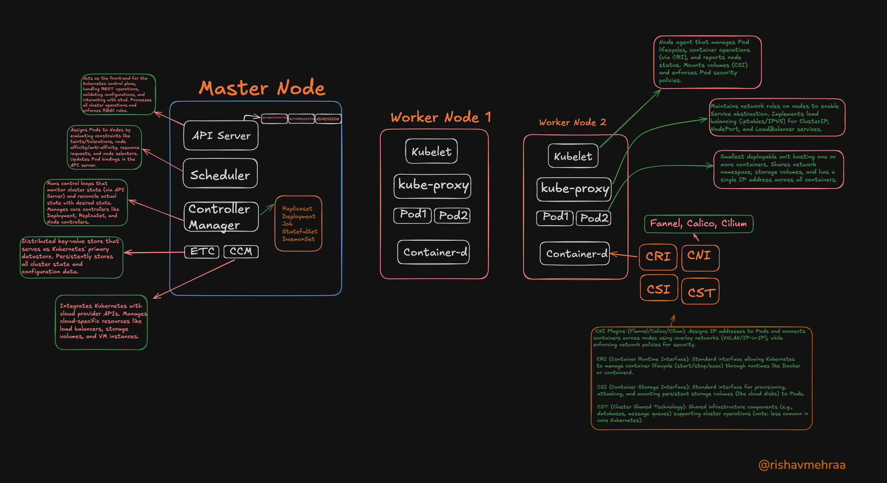

# DevOps

Distributed Systems Check here:
- [Distributed Systems](https://github.com/rishavmehra/distributedsystems)

## Kubernetes

📄 **Reference:**  
- [📌 kubectl Cheat Sheet](https://kubernetes.io/docs/reference/kubectl/quick-reference/)  
- [📘 Pods Documentation](https://kubernetes.io/docs/concepts/workloads/pods/)



---

<details>
<summary>Most Used Commands</summary>
<br>
<pre><code>
$ kubectl get pods
$ kubectl run nginx --image=nginx --dry-run=client -o yaml
$ kubectl describe pod <pod-name>
$ kubectl get pod <pod-name> -o yaml
</code></pre>
</details>

## 🔧 Exercise 1: Working with Pods (Declarative Only)

### 🎯 Task:
> Create a **Pod** in the **default namespace** using a YAML file with the following specifications:
>
> - Use any **container image** of your choice.
> - The pod must have **2 containers**.
> - After applying the YAML, **verify** that the pod is running.

### 📂 Solution:
👉 [00. Exercises/Pod/Pod.yaml](00.%20Exercises/Pod/Pod.yaml)

---

## 🔧 Exercise 2: Expose the App

### 🎯 Task:
> Create a service to expose a Pod in Kubernetes using different service types:
>
> - Create a Pod running an Nginx container that exposes ports 80 and 443.
> - Expose the Pod with a NodePort service on port 30007.
> - Create a LoadBalancer service that exposes the HTTPS port with TLS passthrough.
> - Create another Pod with httpd that shares the same label to demonstrate service selector functionality.

### 📂 Solution:
👉 [00. Exercises/expose-the-app/manifest.yaml](00.%20Exercises/expose-the-app/manifest.yaml) - Nginx Pod  
👉 [00. Exercises/expose-the-app/manifest2.yaml](00.%20Exercises/expose-the-app/manifest2.yaml) - Apache httpd Pod  
👉 [00. Exercises/expose-the-app/svc.yaml](00.%20Exercises/expose-the-app/svc.yaml) - NodePort Service  
👉 [00. Exercises/expose-the-app/svc-lb.yaml](00.%20Exercises/expose-the-app/svc-lb.yaml) - LoadBalancer Service

#### 📚 Key Concepts:
- **Services** act as stable network endpoints for Pods
- **NodePort** exposes the service on each node's IP at a static port
- **LoadBalancer** provisions an external load balancer to route traffic to the service
- **Selectors** determine which Pods a Service targets based on labels

---

## 🔧 Exercise 3: Ingress from First Principle

### 🎯 Task:
> Implement a multi-service architecture with a custom Nginx-based ingress controller:
>
> - Create separate namespaces for frontend and backend applications
> - Deploy a PostgreSQL database
> - Deploy a frontend application (httpd) and a backend service (bun)
> - Implement a custom Nginx reverse proxy to route requests based on domain names:
>   - k8s.rshv.xyz(use your own domain) should route to the backend service
>   - k8s2.rshv.xyz(use your own domain) should route to the frontend service

### 📂 Solution:
👉 [00. Exercises/ingress-first-principle/fe.yaml](00.%20Exercises/ingress-first-principle/fe.yaml) - Frontend Application  
👉 [00. Exercises/ingress-first-principle/backend.yaml](00.%20Exercises/ingress-first-principle/backend.yaml) - Backend Application  
👉 [00. Exercises/ingress-first-principle/db.yaml](00.%20Exercises/ingress-first-principle/db.yaml) - Database Deployment  
👉 [00. Exercises/ingress-first-principle/reverse-proxy.yaml](00.%20Exercises/ingress-first-principle/reverse-proxy.yaml) - Custom Nginx Ingress

#### 📚 Key Concepts:
- **Namespaces** provide isolation between different application components
- **ConfigMaps** store configuration data like Nginx configuration
- **Service Discovery** using Kubernetes DNS (servicename.namespace.svc.cluster.local)
- **Custom Ingress Controller** using Nginx reverse proxy for domain-based routing

## 🔧 Exercise 4: Kubernetes Native Ingress

### 🎯 Task:
> Implement path-based routing using Kubernetes native Ingress resources:
>
> - Deploy two applications: a backend using Nginx and a frontend using Apache httpd
> - Create ClusterIP services for both applications
> - Configure a Kubernetes Ingress resource to route traffic based on URL paths:
>   - /backend path should route to the backend service
>   - /frontend path should route to the frontend service
> - Use annotations to configure URL rewriting

### 📂 Solution:
👉 [00. Exercises/ingress/manifest-be.yaml](00.%20Exercises/ingress/manifest-be.yaml) - Backend Deployment and Service  
👉 [00. Exercises/ingress/manifest-fe.yaml](00.%20Exercises/ingress/manifest-fe.yaml) - Frontend Deployment and Service  
👉 [00. Exercises/ingress/ingress.yaml](00.%20Exercises/ingress/ingress.yaml) - Ingress Resource

#### 📚 Key Concepts:
- **Ingress Resources** provide HTTP/HTTPS routing, path-based routing, and name-based virtual hosting
- **IngressClass** specifies which controller should implement the Ingress
- **Path Types** define how paths are matched (Prefix, Exact, ImplementationSpecific)
- **Annotations** configure controller-specific behaviors like URL rewriting
- **Ingress Controller** is the component that actually implements the Ingress rules (typically Nginx)

---
# HELM
[Cheat Sheet](https://helm.sh/docs/intro/cheatsheet/)
```
// Install a chart from a local directory
helm create mychart
helm install mychartrelease mychart

// Uninstall a release
helm uninstall mychartrelease

// List releases
helm list -a

// upgrade the the helm chart
helm upgrade mychartrelease mychart

// rollback to a previous version
helm rollback mychartrelease 1

// debug
helm install --dry-run --debug mychartrelease mychart

// helm template
helm template mychart


// helm lint
helm lint mychart

```